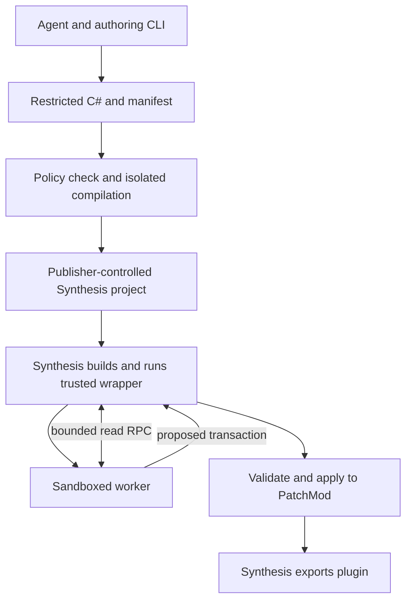

# SafeSynthesis: sandboxed, agent-authored Skyrim patchers that run in Synthesis

**Status:** implementation design, September 2026  
**Initial target:** Skyrim Special Edition / Anniversary Edition, Windows x64, a normal Synthesis local-solution or Git patcher  
**Primary authoring language:** constrained C#  
**Key decision:** Synthesis runs trusted wrapper code; agent-authored algorithms run in a separate, OS-contained process and return a validated patch transaction.

## 1. Purpose and scope

An agent should be able to author an algorithm as expressive as a conventional C# Synthesis patcher, package it into a reusable patcher, and have Synthesis build and run that patcher as part of a normal patch group. The agent algorithm must not acquire the host's filesystem, network, process, registry, or Mutagen write authority. The trusted wrapper ultimately modifies `state.PatchMod`, so Synthesis remains responsible for its usual orchestration and export. Synthesis documents `state.LoadOrder` as read-only input and `state.PatchMod` as the output mod. [S1]

The system consists of an **authoring toolchain** and a **runtime**. The former inspects load orders, generates and tests C#, and publishes a controlled package. The latter is invoked by Synthesis, serves bounded record queries to a worker, validates its proposed changes, and applies them to the Synthesis patch state. MCP is one possible authoring adapter; the package has no dependency on MCP at runtime.

This is a design, not a claim that the sandbox or record adapter has already been implemented. The exact Windows containment, Mutagen copy semantics, Synthesis output failure behavior, and large-load-order costs have explicit proof-of-concept gates below.

### Goals

1. Express loops, functions, collections, graph traversals, merge heuristics, and record-specific algorithms in C#.
2. Run as an ordinary Synthesis patcher, with the same placement and group behavior as other patchers.
3. Give agent code only a defined read model, typed settings, diagnostic output, and the ability to propose changes to the current output plugin.
4. Make each generated program reproducible, versionable, inspectable, and rerunnable when the load order changes.
5. Reject invalid, out-of-scope, or unexpectedly broad changes before changing `state.PatchMod`.
6. Report record-level provenance, differences, validation results, and resource usage.

### Deliberate limits

- First release supports selected record types and fields (beginning with leveled items); the language can express general algorithms, but a record can be edited only when a trusted adapter exposes its data and mutations.
- It does not promise to prove a patch's gameplay semantics correct. Structural validation and regression cases support human review.
- It does not sandbox Synthesis itself, the .NET SDK, MSBuild, NuGet restore, or the trusted wrapper. A Synthesis Git patcher clones and builds a project on the user's machine. Project files, imported targets, dependencies, and the wrapper are therefore **trusted code**, even if the agent source is isolated. [S2][S3]
- It does not automatically convert every existing Synthesis patcher: direct Mutagen access, arbitrary file input, and reflection require manual adaptation or a new, explicitly reviewed capability.

## 2. Trust model and guarantees

| Component/input | Trust level | Authority and rule |
| --- | --- | --- |
| Synthesis, Mutagen, .NET runtime, OS | Existing platform trust | Build, read plugins, and write the requested output using their normal behavior. |
| Generated `.sln`, `.csproj`, `Program.cs`, runtime package, worker binary | Trusted publisher-controlled template | Runs with normal patcher/build privileges. The agent cannot edit these. Pin versions and review changes. |
| Agent C# and its compiled assembly | Untrusted | Compiled by a controlled toolchain; loaded only in the contained worker. No direct host objects or file paths. |
| Manifest, settings, worker IPC, record strings | Untrusted data | Strictly parsed and bounded. A manifest may request less authority than the publisher's policy, never more. |
| Trusted patch host | Trusted, high privilege | Exposes narrow read queries, validates mutations, and applies them to `state.PatchMod`. |
| Filesystem, Internet, process creation | No worker capability | Enforced by OS containment, not by Roslyn conventions. The wrapper/build may still use these resources. |

The threat model covers malicious or mistaken **agent-authored patch logic** and malformed messages from its worker. It assumes the publisher-controlled Synthesis project, runtime binaries, and build dependencies remain trusted. An arbitrary Git repository advertising itself as a SafeSynthesis patcher is not thereby safe; changing its project or `Program.cs` can execute ordinary code during build or launch. Microsoft explicitly warns that unknown MSBuild logic can execute arbitrary code. [S3]

The static C# policy is a useful error filter. It is **not** the security boundary: .NET code access security and partial trust are not supported as such a boundary. The worker must have OS-enforced containment, with fail-closed startup if containment cannot be established. [S4]

## 3. End-to-end architecture



At package time the trusted generator compiles the agent program with a fixed compiler/reference pack and ships the resulting assembly as inert content. Synthesis builds the **wrapper**, not the agent source. At run time the wrapper checks package metadata, opens a narrow IPC channel, launches a contained worker, and sends it the program bytes and validated settings. The worker loads those bytes in its own process. The wrapper never calls or loads an agent-defined type.

The code that Synthesis compiles can be essentially fixed:

```csharp
public static class Program
{
    public static Task<int> Main(string[] args) =>
        SynthesisPipeline.Instance
            .AddPatch<ISkyrimMod, ISkyrimModGetter>(
                state => SafePatchHost.Run(state, "payload/patch.bin", "payload/manifest.json"))
            .SetTypicalOpen(GameRelease.SkyrimSE, "SafeGeneratedPatch.esp")
            .Run(args);
}
```

This is illustrative; method signatures and sync/async behavior must be checked against pinned Synthesis versions. Synthesis's documented entry-point pattern is `AddPatch(...).SetTypicalOpen(...).Run(args)`. The actual output name when Synthesis launches a patcher comes from its run configuration, so the standalone name is a default, not the authority for output paths. [S1][S5]

### Runtime sequence

1. **Synthesis prepares state.** The wrapper receives the current `IPatcherState`. Its view of the load order and previous patch results must follow Synthesis's placement and group semantics.
2. **Preflight.** Verify manifest schema/API version, artifact integrity, supported game release, declared policies and budgets, settings, runtime binaries, and sandbox availability. Reject unsupported record capabilities early.
3. **Launch worker.** Create its contained process with only the required IPC handles. Give it no Synthesis CLI arguments, game paths, inherited environment secrets, or Mutagen objects.
4. **Read phase.** Serve record enumeration, override-chain, link-resolution, and selected field queries from a run-scoped effective view. Use bounded pages and caches.
5. **Proposal phase.** Worker computes a finite list of edits and diagnostics. It may read its own staged proposal locally, but it cannot cause host mutation during computation.
6. **Validation phase.** Verify the whole proposal and build a candidate patch state for the touched records. Recheck all input hashes/versions and the resulting records. Show or store a reviewable diff.
7. **Commit phase.** Apply the validated edits to `state.PatchMod` through Mutagen. Throw on any failure, which must stop this Synthesis invocation; never silently continue to later patchers with partial state.
8. **Export.** Synthesis performs its normal export. The worker never writes an ESP or touches MO2.

Synthesis says patchers in one group build on earlier patchers' changes, and groups see earlier groups according to load order. A patch only considers mods before its output plugin. The host's **effective view** must include the state actually visible to this patcher, including earlier changes in the same group, rather than rebuilding a separate `plugins.txt` view that loses them. Verify this against Synthesis in an integration test. [S6]

## 4. Projects and package layout

Suggested solution boundaries:

| Project | Responsibility |
| --- | --- |
| `SafePatch.Contracts` | Versioned DTOs, IDs, wire schema, field descriptors; no Mutagen or filesystem dependencies. |
| `SafePatch.Authoring` | Record inspection, authoring CLI, plan/test report generation, publisher policy. |
| `SafePatch.Compiler` | Controlled Roslyn compilation and diagnostics, immutable references, emitted artifact and hash. Run this in an isolated build environment. |
| `SafePatch.Worker` | Loads the compiled artifact inside the OS sandbox, implements SDK and IPC, maintains a local proposal. |
| `SafePatch.SynthesisHost` | Synthesis entry-point library, effective-view query service, IPC broker, validator, Mutagen commit adapters. |
| `SafePatch.WindowsSandbox` | Launch, AppContainer/LPAC experiment, handle allow-list, Job Object limits, cleanup and probes. |
| `SafePatch.SkyrimAdapters` | Typed projection and mutation for supported Skyrim record families. |
| `SafePatch.Generator` | Emits the publisher-controlled Synthesis repository from a pinned template. |
| `SafePatch.Mcp` | Optional thin authoring/query interface; not packaged into the patcher. |

Output from the generator:

```text
GeneratedCompatibilityPatch/
  GeneratedCompatibilityPatch.sln
  GeneratedCompatibilityPatch/
    GeneratedCompatibilityPatch.csproj
    Program.cs                    # trusted template
    SynthesisMeta.json            # normal Synthesis metadata
    payload/
      patch.bin                   # compiled untrusted code; content only
      patch.safe.cs               # audit source; content only
      manifest.json
      publisher-attestation.json
    tests/
      expected-diff.json
  reports/
    latest-validation.json
    latest-review.md
```

The project must explicitly list trusted C# compile inputs, with default globbing disabled; `.safe.cs` is packaged as content and never included in `Compile`. The worker binary and runtime can come from **pinned, publisher-reviewed** packages. Lock package versions and hashes; evaluate package build assets because NuGet packages may import `.props` and `.targets`. No agent-supplied `.csproj`, MSBuild targets, NuGet sources/packages, analyzers, generators, post-build commands, or arbitrary embedded DLLs enter the generated repository. [S3][S7]

For publisher-controlled distribution, make releases through a generator and CI that allow only intended payload/metadata changes relative to the trusted template. Pin a release commit when reproducibility matters. An optional publisher signature over payload hash, policy, API version, and template version protects the payload against modification **if the verifier/runtime itself is independently trusted**; a hash stored beside an editable payload is not an authenticity guarantee. Synthesis's ordinary Git patcher workflow clones and builds a repo, and its browser has separate discovery rules; registration is an optional publication step, not required for a working local or manually added Git patcher. [S2][S8]

## 5. Authoring API: full algorithms over limited capabilities

The author writes ordinary C# logic against a versioned `IPatchContext`:

```csharp
public interface ISafePatch
{
    void Run(IPatchContext context);
}

public interface IPatchContext
{
    IRecordQueries Records { get; }    // read-only immutable DTOs
    IPatchProposal Patch { get; }      // proposed operations, not Mutagen objects
    IReadOnlySettings Settings { get; }
    IDiagnostics Diagnostics { get; }
}
```

Loops, helpers, recursion, custom data structures, and collection algorithms remain available. The agent cannot obtain `IPatcherState`, `ISkyrimMod`, `ILinkCache`, a file path, or a real mutable record. SDK contracts and adapters are separate: the worker sees canonical value objects; the host uses Mutagen internally.

An initial typed surface should cover `LVLI` (`LeveledItem`), relevant entries and flags, and the linked record identities needed for leveled-list merging. Add `LVLN`, `LVSP`, `COBJ`, `INGR`, `ALCH`, `NPC_`, etc. as independently tested adapters. Each adapter declares its projection schema, field path identifiers, mutation rules, equality/hash semantics, supported game versions, and round-trip fixtures. Keep unknown fields in the host's source record and copy the current winner before changing specified fields; an adapter must not rewrite a record using an incomplete DTO.

Example *shape* for an algorithm, without asserting the exact rules of the linked CACO utility:

```csharp
foreach (var list in ctx.Records.LeveledItems.WinningOverrides(pageSize: 256))
{
    var chain = ctx.Records.GetOverrideChain(list.FormKey);
    var source = chain.FromMod("Complete Alchemy & Cooking Overhaul.esp");
    if (source is null) continue;

    var merged = MergeEntries(list.Entries, source.Entries, ctx.Settings);
    if (merged.SequenceEqual(list.Entries)) continue;

    ctx.Patch.ReplaceField(
        list.FormKey, Field.LeveledItemEntries, merged,
        expectedRecordVersion: list.Version);
}
```

`MergeEntries` can use arbitrary C# control flow. The definition of equality, ordering, multiplicity, flags, deleted entries, and override ancestry belongs in its algorithm and tests, not in a generic `union` primitive. The linked CACO source was identified as the intended expressiveness fixture, but its file content was not retrievable during this design pass; the implementation phase must inspect the actual file and reproduce representative cases before claiming equivalence. [S9]

### C# compilation policy

Compile with pinned Roslyn and reference assemblies. Semantic symbol checks should allow approved framework and SDK members, not trust namespaces or assembly names alone: core runtime assemblies also expose methods an agent should not call. Reject `unsafe`, P/Invoke, `dynamic`, reflection and assembly loading, `#r`/`#load`, arbitrary attributes and module initializers, source generators, unapproved analyzers/references, and unsupported interop. Inspect resolved member calls, conversions, attributes, base types, and emitted metadata, and fail on unresolved symbols. Keep an explicit set of approved pure operations and grow it against real algorithms. Roslyn's compilation and semantic model support fixed references and resolved-symbol inspection. [S10]

Policy checks are for diagnostics and defense in depth. No plausible member allow-list proves a general .NET program harmless; even approved code can loop indefinitely, allocate excessively, or trigger runtime/compiler defects. The OS sandbox, quotas, narrow data API, and transaction validator remain mandatory.

## 6. Record model and mutation protocol

### Identity and reads

- Use a typed `RecordId { Game, FormKey, RecordType }`, not EditorID as identity. A source version also carries source ModKey, load-order position, and a canonical hash of the projected fields the algorithm relies on.
- `GetWinning`, `GetOverrideChain`, `ResolveLink`, and `Scan(recordType, predicate, pageToken)` operate on a run-scoped snapshot. Explicitly specify whether a query sees original load-order data, the previous Synthesis patch state, or the worker's local proposed edits; default to the **pre-run effective winner**, and keep proposal reads separate.
- Push down common indexed filters (record type, touched-by mod, EditorID prefix, links, changed-field set). Page large results and cap bytes/records per response. Never let the worker pass a filesystem path or raw Mutagen type name as a query.
- Build indexes lazily from Mutagen and cache projected immutable DTOs. Start with paged RPC; measure it before adding a compact local mirror. If shared memory is later used, make it read-only to the worker and validate offsets and sizes.

### Proposal operations

Version 1 uses a small, typed operation algebra:

```text
EditRecord(recordId, expectedVersion, [ReplaceField(fieldId, typedValue), ...])
CreateRecord(symbolicId, recordType, initialTypedFields)
DeleteCreatedRecord(symbolicId)                # only a worker-local creation
Diagnostic(severity, code, recordId?, message)
```

No deletion of existing records in version 1. An edit means: obtain or add an override from the **current effective winning record**, then replace only listed fields. An agent can forward a field from a chosen override by reading that version and using its value in `ReplaceField`. The host rejects duplicate/conflicting writes to a field unless the protocol defines an unambiguous last-write rule; initially, reject them. Whole-record replacement is absent because it can discard unrelated overrides.

For `CreateRecord`, the worker uses symbolic IDs such as `"new_list_iron_01"`. The host resolves these at commit, keeps a stable mapping across reruns where needed, and verifies links and FormID limits. Investigate Synthesis/Mutagen's FormKey allocation facilities before designing custom persistent state; do not derive IDs from a hash without collision and migration handling.

The transaction envelope contains `schemaVersion`, `runId`, `programHash`, `settingsHash`, `inputFingerprint`, declared read/write scope, operations, and bounded diagnostics. Each operation has a sequence number and provenance (rule ID, selected source versions, reason code). On receipt the host enforces message size/count, enum and union discriminants, string lengths, recursion depth, numeric ranges, and finite resources. An arbitrary diagnostic cannot become a host command or a path.

### Settings

Settings are declarative data: boolean, bounded number, enum, string, and typed ModKey/FormKey selections. The trusted wrapper owns Synthesis settings integration and validates a deserialized settings DTO before sending it to the worker. Synthesis exposes `SetAutogeneratedSettings`, but the exact UI binding and serialization shape need a compatibility spike against the pinned version. Script-defined executable settings types never load into the wrapper. [S5]

## 7. Validation and commit

Validation is a separate subsystem with versioned rules and machine-readable results. It runs on the complete proposal against the same run-scoped input and current patch state.

| Layer | Checks and failure behavior |
| --- | --- |
| Policy | The requested record types, fields, source mods, create count, operation count, and change volume fit a **publisher-controlled maximum**. Manifest declarations can narrow it. |
| Preconditions | Every referenced record and expected version exists; no concurrent/stale input; source override belongs to the captured chain; symbolic IDs are valid and unique. |
| Structural | Type-correct fields, supported record paths, valid ranges/flags, valid links and masters, no duplicate FormKeys, appropriate record type and game release. |
| Domain | Per-adapter invariants: list length, entry levels/counts and legal link targets; localized strings and special record-specific constraints as adapters expand. |
| Diff | Construct touched-record candidates, compute semantic before/after diff, unchanged-field check, provenance, and guardrails for unexpectedly broad rewrites. |
| Export | Validate the candidate through the relevant Mutagen serialization/link/master checks; perform a round-trip test in authoring CI and, where feasible, a run-time preflight on the candidate. |

Only the trusted host can call `GetOrAddAsOverride` or allocate new records. It computes candidate results without modifying `state.PatchMod` and verifies them first. The commit adapter applies a deterministic, already validated sequence. If a commit call fails, it aborts the entire Synthesis invocation and must not resume later patchers. This provides **proposal atomicity before commit**, not an unqualified guarantee that Synthesis can roll back a partially mutated in-memory `PatchMod` or that its outer output file update is atomic. The Synthesis failure/export behavior and an optional detached `PatchMod` swap need implementation tests before stronger claims.

The report includes affected FormKeys and fields; sources chosen; old/new values with list-aware diffs; resolved, remaining, and new conflicts **within the analyzed scope**; invalid references; warnings; and limits reached. “Zero new conflicts” is meaningful only after defining conflict detection and the scope being compared. A structurally valid patch can still make the wrong gameplay choice, so the review gate can be configured to require human approval for high-impact or novel changes during authoring.

## 8. Windows worker containment and IPC

**Baseline to prototype:** an AppContainer process with no network capabilities, no data-file grants, only the minimum read/execute access necessary for the worker and .NET runtime, and explicitly granted IPC handles. Evaluate LPAC if the runtime can start under it. AppContainer's token and capabilities restrict access to files, registry, network, and other processes; details depend on the exact Windows/runtime configuration. [S11]

The launcher creates the worker suspended, installs a Job Object with process/memory/time-related limits and kill-on-close, constrains inherited handles via `STARTUPINFOEX` handle allow-list, removes unneeded environment variables, applies any compatible process mitigations, resumes, monitors, and kills it on timeout. Job Objects alone are resource/process management, **not** a filesystem or network sandbox. A one-active-process limit and mitigations should be tested rather than presumed sufficient on every Windows build and under MO2. [S12][S13]

IPC uses dedicated anonymous pipes or an equivalently scoped local channel. Define a length-prefixed, versioned, binary message format and bounded state machine: `Hello → Query*/Reply* → SubmitTransaction → Result → Close`. Authenticate the one child via inherited handles and a random per-run nonce. The host never treats a client-supplied path as an instruction to open a file. Time out stalled requests; cancel on Synthesis cancellation; bound concurrency, query cost, total bytes, and logs; dispose handles on any failure.

The worker may need runtime DLL reads and private memory. Build an automated sandbox-probe suite that runs **inside the worker** and attempts file read/write/delete outside its allowed runtime, network and loopback connections, child process launch, registry writes, inherited-handle enumeration, and IPC abuse. If a required denial fails, or the sandbox cannot launch under the supported Windows/MO2 combination, the patcher fails closed. Microsoft recommends OS isolation rather than .NET partial trust for untrusted code. [S4][S11]

Important scope distinction: Synthesis may fetch Git and NuGet dependencies before launching the wrapper; the claim of “no Internet access” applies only to the **agent worker**. Code in a malicious project or dependency can execute before this containment. [S2][S3]

## 9. Authoring workflow and optional MCP surface

Authoring runs outside Synthesis and uses a service layer callable from CLI, tests, or MCP:

```text
load-order snapshot → inspect overrides/conflicts → draft C# + manifest
→ compile policy check → isolated test runs → diff review
→ controlled package generator → CI checks → versioned Git release
→ Synthesis Git or local-solution patcher
```

The authoring service can offer `get_load_order`, `get_record`, `get_override_chain`, `query_records`, `diff_records`, `find_references`, `test_patch`, `validate_patch`, `explain_diff`, and `package_synthesis_patcher`. The MCP adapter merely serializes these operations; it has no secret direct write route. Persist source, settings schema, decisions/provenance, fixture inputs, output diff, policy version, compiler/runtime versions, and tests in Git. The *code* is the durable algorithm; a JSON manifest describes permissions and packaging, not complex algorithmic semantics.

In the initial workflow an agent proposes and tests patches, while a publisher-controlled tool generates the trusted project. Automatic regeneration on modlist changes can reuse a versioned rule program, re-run tests and validation, and publish a new package through the same gate. Do not let the agent edit CI configuration or trusted template files to make its own patch “pass.”

## 10. Compatibility, determinism, and scale

- **Synthesis behavior:** test manual Git addition, local solution, normal build and run, same-group preceding/following patchers, cross-group ordering, rerun with output plugin enabled, and output name/placement. Synthesis documents the group and load-order rules. [S6]
- **MO2:** test both normal launch and MO2 VFS launch. Current Synthesis reports include build/VFS issues, so explicitly record supported combinations and never silently weaken containment to make one work. [S14]
- **Large modlists:** measure cold index build, projected bytes, query round trips, transaction size, peak worker/host memory, and commit time at a representative thousands-of-plugins scale. Page and cache; add a local immutable mirror only after a profile establishes the bottleneck.
- **Stable results:** define ordering in every scan and merge; pin SDK/compiler/adapter versions; avoid wall clock and ambient randomness in worker SDK; canonicalize serialization and settings. Capture a fingerprint of visible mods/versions and relevant record hashes. Plugin-file byte hashes are optional but more expensive.
- **FormIDs/master counts:** record allocation, ESL eligibility, master overflow, and split-output behavior are adapter and Synthesis compatibility concerns. Avoid promising a single output plugin on every load order; Synthesis supports split outputs under applicable settings, and recent user-reported edge cases make this a test gate. [S15]
- **Updates:** version the SDK wire format separately from record adapters and publisher template. A patch package pins compatible versions; a newer runtime must either migrate explicitly or fail with a useful diagnostic.

## 11. Implementation phases and exit criteria

| Phase | Deliverable | Exit gate |
| --- | --- | --- |
| 0. Feasibility spikes | Minimal trusted Synthesis wrapper, contained .NET worker, IPC, same-group visibility experiment. | Synthesis runs the wrapper and a worker that cannot read a chosen user file, write outside its allowance, connect to network, or start a child; the wrapper changes one `LVLI` field in `PatchMod`. |
| 1. Narrow vertical slice | `LVLI` DTO/adapter, paged winning/chain queries, `ReplaceField`, policy/manifest, transaction validator. | A C# algorithm merges a small fixture with two conflicting list overrides; a following patcher sees the result; malformed proposals change nothing. |
| 2. Trusted generator | Fixed project template, isolated compile/policy check, source/assembly packaging, pinned dependencies and review report. | Fresh machine adds generated Git/local patcher and runs it in Synthesis without manually assembling binaries; agent source never enters trusted compilation or runtime loading. |
| 3. Correctness and attack testing | Mutagen round trips, reference/master validation, negative security tests, fuzzing of IPC/transaction parsers, deterministic reruns. | Every defined invariant and failure mode has fixtures; worker escape attempts fail; errors fail closed; same inputs produce the same semantic diff. |
| 4. CACO expressiveness fixture | Inspect the linked utility, port representative leveled-list cases into the safe SDK, compare outputs with golden tests. | Real helper logic requires no custom language feature; any missing record capability is identified as an adapter addition, with measured cost. |
| 5. Broader authoring | More record adapters, settings UI, agent inspection API/MCP, provenance and conflict-delta reports, incremental cache. | A multi-record patch runs on a representative modlist; reports support review of every changed field. |
| 6. Release hardening | Signed/pinned publication process, compatibility matrix, upgrade/migration policy, documentation. | One-click Synthesis consumption from a controlled release; version rollback works; unsupported Windows/MO2 paths fail with clear diagnostics. |

### Minimum test matrix

1. **Functional:** no-op, empty load order, two-source merge, multiple overrides, linked records, deleted/missing source records, prior same-group patch, later same-group reader, another group, rerun after source update.
2. **Validation:** wrong type, invalid FormKey/link/master, duplicate creation, stale expected version, forbidden field, oversized list, malformed protocol, worker crash, timeout, cancellation, Synthesis export failure.
3. **Security:** forbidden C# symbols and compilation inputs; reflection/interop attempts; file/network/process/registry probes; malicious settings, strings, and diagnostics; worker payload tampering; template/dependency drift in publication CI.
4. **Performance:** thousands-of-plugins load order, dense override chains, very large leveled lists, high query counts, many small edits, and transaction-size limits.

## 12. Design decisions still requiring evidence

1. **AppContainer vs LPAC:** run the .NET worker and all dependencies in both modes on the target Windows versions; choose the narrower working configuration. A sandbox that only works outside MO2 may require an explicit unsupported-mode error or revised launch strategy.
2. **Same-group effective view:** confirm precisely which Synthesis state objects include earlier patchers' changes and how an override chain should represent the in-progress output mod.
3. **Detached candidate commit:** determine whether `PatchMod` can be cloned/swapped or whether the host must validate touched records before committing in place and rely on Synthesis abort behavior after an exception.
4. **Creation IDs:** verify Synthesis/Mutagen allocation APIs and persistence across reruns before finalizing the symbolic-ID mapping.
5. **Model coverage:** inspect the actual CACO implementation to choose the minimum safe `LVLI` DTO fields and whether it needs contextual records or recursive list traversal.
6. **Publisher model:** decide whether the goal is trusted generation for one's own repositories or a general platform for third-party generated patchers. The latter needs a separate trust and distribution story; the worker sandbox does not contain untrusted MSBuild projects.

## Sources and verification notes

- **[S1]** [Synthesis: Coding a Patcher](https://mutagen-modding.github.io/Synthesis/devs/Coding-a-Patcher/) and [development guide](https://github.com/Mutagen-Modding/Synthesis/blob/dev/DEVELOPMENT.md): entry point, `IPatcherState`, `LoadOrder`, `PatchMod`.
- **[S2]** [Synthesis: Git Repository Patcher](https://mutagen-modding.github.io/Synthesis/Git-Repository-Patcher/): clone/build/run model.
- **[S3]** [Microsoft: Secure MSBuild usage](https://learn.microsoft.com/en-us/visualstudio/msbuild/msbuild-security-best-practices): unknown build logic executes with build privileges.
- **[S4]** [Microsoft: Secure coding guidelines for .NET](https://learn.microsoft.com/en-us/dotnet/standard/security/secure-coding-guidelines): partial trust is not a supported security boundary.
- **[S5]** [Synthesis: Configuring a Patcher at Startup](https://mutagen-modding.github.io/Synthesis/devs/Configuring-a-Patcher-at-Startup/): entry-point settings and standalone behavior.
- **[S6]** [Synthesis: Load Order of Patches](https://mutagen-modding.github.io/Synthesis/LoadOrder/): visibility and grouping semantics.
- **[S7]** [Microsoft: NuGet package MSBuild assets](https://learn.microsoft.com/en-us/nuget/concepts/msbuild-props-and-targets): dependency imports during build.
- **[S8]** [Synthesis: Publishing](https://mutagen-modding.github.io/Synthesis/devs/Publishing/) and [Synthesis.Registry](https://github.com/Mutagen-Modding/Synthesis.Registry): browser requirements and discovery.
- **[S9]** [CACO Patcher repository](https://github.com/panthuncia/CACO_Patcher) and the [linked utility](https://github.com/panthuncia/CACO_Patcher/blob/master/CACO_Patcher/Utilities/LeveledListUtilities.cs). The repository overview was accessible; the individual utility source could not be fetched during this research, so this document makes no claim about its precise merge semantics.
- **[S10]** [Microsoft: Roslyn semantic model](https://learn.microsoft.com/en-us/dotnet/csharp/roslyn-sdk/work-with-semantics) and [`CSharpCompilation.Create`](https://learn.microsoft.com/en-us/dotnet/api/microsoft.codeanalysis.csharp.csharpcompilation.create).
- **[S11]** [Microsoft: AppContainer isolation](https://learn.microsoft.com/en-us/windows/win32/secauthz/appcontainer-isolation) and [launching an AppContainer](https://learn.microsoft.com/en-us/windows/win32/secauthz/implementing-an-appcontainer).
- **[S12]** [Microsoft: Job Objects](https://learn.microsoft.com/en-us/windows/win32/procthread/job-objects) and [extended limits](https://learn.microsoft.com/en-us/windows/win32/api/winnt/ns-winnt-jobobject_extended_limit_information).
- **[S13]** [Microsoft: process creation and handle inheritance](https://learn.microsoft.com/en-us/windows/win32/procthread/creating-processes).
- **[S14]** [Synthesis: Running and Debugging](https://mutagen-modding.github.io/Synthesis/devs/Running-and-Debugging/) and [MO2 build issue](https://github.com/Mutagen-Modding/Synthesis/issues/592).
- **[S15]** [Synthesis: Load Order / split patches](https://mutagen-modding.github.io/Synthesis/LoadOrder/) and [large-load-order issue report](https://github.com/Mutagen-Modding/Synthesis/issues/594). An issue report is a compatibility test signal, not a universal statement about Synthesis behavior.
